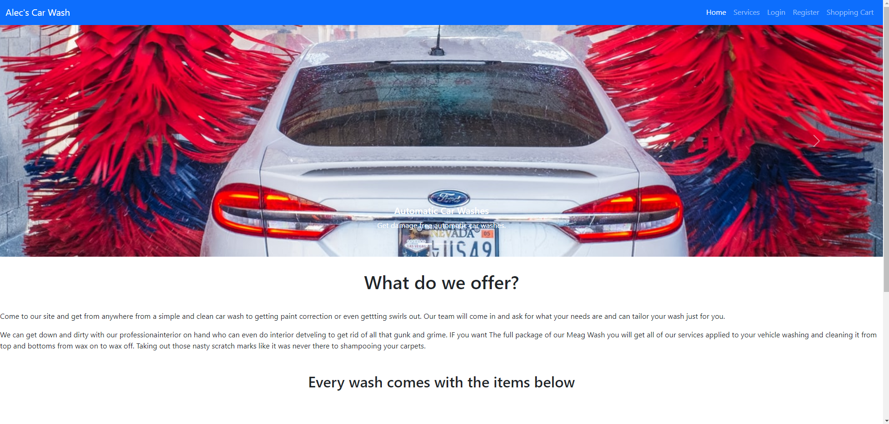
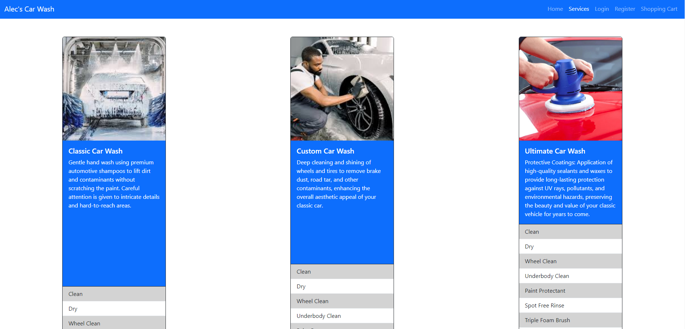
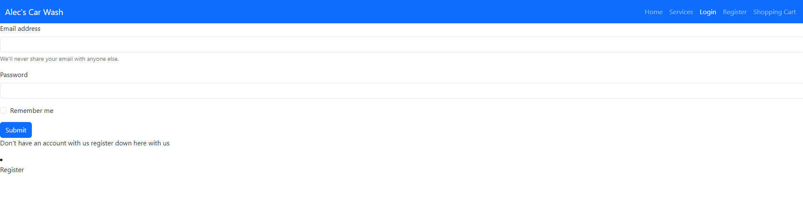
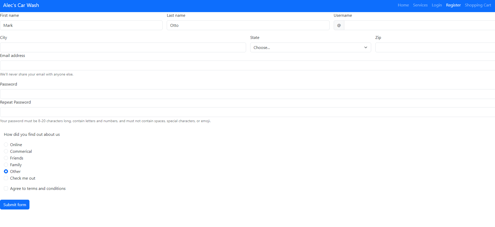
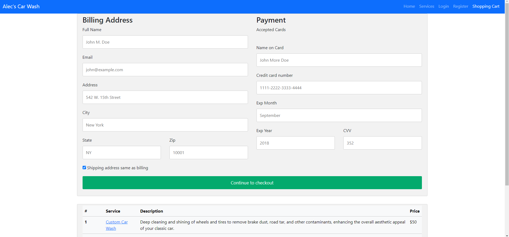

# car_wash_capstone

This capstone project is a car wash website with 5 pages:

1. index.html
2. services.html
3. user_login.html
4. user_registration.html
5. checkout2.html

## Technolgies Used 

The technologies used in this project include;

* HTML
* CSS 
* Bootstrap

# The Home Page 

The home page is located in the index.html file where you are greeted with a carasoul of services. Down below we give a brief description of what we offer. As such each service always inludes the following:

1. Free vacuums
2. Detaling air 
3. Glass cleaner
4. Mat cleaners 
5. Tire air 
6. Multi-purpose cleaner 

One thing I did was to edit the carousel in css to transform it more to become a banner.

# Services Page 

The services page is located under the services.html file here you can choose 6 different options to apply to your car. Simply the button at the bottom of the service card to add to cart. The services are as follows:

1. Classic Car Wash 
2. Custom Car Wash 
3. Ultiamte Car Wash 
4. Paint Correction
5. Intertior Clean 
6. Mega Wash 

One thing i did interesting on this page was making the cards being able to be spaced out evenly with css space-arounnd 

# Login Page 

If you have an account with us you can simply schedule a time with us at any available time depending on the service. You could come on right by and get a wash right away. Also if your a new memeber you can sign up a the register link below. 

One thing I did with html is putting a register link if the customer doesn't have an account with the site.

# Registration Page 

If your new to our site you can simply register and create an account with us to get started. Make sure you give us some feedabck on how you heard about us so that we can grow and expand on giving everyone a great wash experience.

One thing I did with html was require setting your password twice to confirm that is what you want.

# Checkout Page 

Once you have create an account with us and picked what services you would want you come to the checkout page. Here you can just put in your payment options and get started scheduling your next wash. 

One things I did with css is applying to my table to make it more appeealing and and to be consistent.

